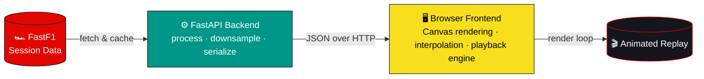

<div align="center">


<a href="https://github.com/DevGopi-16/f1-race-replay">
  
</a>

<br/>


<br/><br/>


<sub>2025 Singapore GP · Marina Bay · Lap 52/62 — full leaderboard, tyre compounds, live telemetry & DRS overlays</sub>

<br/><br/>

<a href="#-getting-started"></a>
<a href="#-features"></a>
<a href="#-architecture"></a>
<a href="#-contributing"></a>

</div>

[](https://github.com/DevGopi-16)

## 💡 Why This Exists

> F1 broadcasts show you *what* is happening. FastF1 gives you the raw telemetry that explains *why*.

This project bridges the two — turning session-level timing and telemetry data into an interactive, replayable visualization anyone can explore in a browser, with zero Python or notebooks required on the viewer's end.

It's also a real engineering exercise in its own right: large time-series datasets, client-side interpolation for smooth animation, payload optimization for the browser, and a full rendering pipeline built from scratch on HTML5 Canvas.

[](https://github.com/DevGopi-16)

## ✨ Features

<table>
<tr>
<td width="50%" valign="top">

### 🏁 Race Replay
- Accurate track map with animated car positions
- Sector visualization (S1 / S2 / S3) & toggleable DRS zones
- Seekable timeline with incident markers (🟡 Yellow / 🔴 Red / 🚨 SC / VSC)
- Variable playback speed (0.5x – 4x)

### 📊 Live Telemetry
- Speed, gear, throttle %, brake %, DRS status per driver
- Tyre compound & remaining stint life
- Live gap ahead/behind, in metres

</td>
<td width="50%" valign="top">

### 🛞 Tyre Strategy
- Current compound (Soft / Medium / Hard) & stint age
- Per-driver tyre indicator on the leaderboard

### 🌦 Weather
- Track/air temperature, humidity, wind speed, rain status

### 🏆 Leaderboard
- Full running order with live time gaps
- Team-coloured driver tags + DRS indicators
- Highlighted focus driver with quick stat panel

</td>
</tr>
</table>

### 🔬 Multi-Driver Comparison
Shift+click to select multiple drivers → overlaid speed / throttle / brake traces, with a live delta readout between any two selected drivers.

<br/>

### 🎮 Playback Controls

<div align="center">

| Key | Action | Key | Action |
|:---:|:---|:---:|:---|
| `Space` | Play / Pause | `1`–`4` | Set speed (0.5x/1x/2x/4x) |
| `←` `→` | Rewind / Forward | `R` | Restart |
| `↑` `↓` | Speed +/− | `D` | Toggle DRS zones |
| `S` | Toggle sectors | `B` | Toggle progress bar |
| `H` | Toggle panel visibility | `Shift+Click` | Select multiple drivers |

</div>

[](https://github.com/DevGopi-16)

## 🏗 Architecture



Telemetry is fetched once per session via FastF1, cached locally, downsampled and serialized on the backend, then streamed to the browser — where it's interpolated frame-by-frame for smooth playback without shipping every raw data point over the wire.

[](https://github.com/DevGopi-16)

## 🛠 Tech Stack

<div align="center">

| Layer | Technology |
|:---|:---|
| **Backend** |  Python |
| **Data Source** |  |
| **Frontend** |    |
| **Rendering** | HTML5 Canvas / SVG overlays |

</div>

<br/>

## 📂 Project Structure

<details>
<summary><b>Click to expand full directory tree</b></summary>

```text
F1-RACE-REPLAY-WEB/
│
├── assets/
│   ├── banners.md
│   ├── dividers/
│   ├── file_headers/
│   ├── headers/
│   ├── icons/
│   ├── loadings/
│   ├── progress_bars/
│   └── visuals/
│
├── backend/
│   ├── .fastf1-cache/          # FastF1 local data cache
│   ├── computed_data/          # Precomputed/serialized race data
│   ├── data/
│   │   └── drivers.json
│   ├── src/
│   │   ├── lib/
│   │   │   ├── settings.py
│   │   │   ├── time.py
│   │   │   └── tyres.py
│   │   ├── f1_data.py          # FastF1 data loading & processing
│   │   ├── serialize.py        # Telemetry serialization for the frontend
│   │   └── track_geometry.py   # Track map / coordinate generation
│   ├── main.py                 # FastAPI application entry point
│   └── requirements.txt
│
├── frontend/
│   ├── index.html
│   ├── static/
│   │   ├── images/
│   │   │   ├── banners/
│   │   │   ├── controls/
│   │   │   ├── drivers/
│   │   │   ├── teams/
│   │   │   ├── tyres/
│   │   │   └── weather/
│   │   ├── app.js              # Playback engine & UI logic
│   │   └── style.css
│
├── .gitignore
├── README.md
└── requirements.txt
```

</details>

[](https://github.com/DevGopi-16)

## 🚀 Getting Started

### Prerequisites


### Installation & Run

```bash
git clone https://github.com/DevGopi-16/f1-race-replay.git
cd F1-RACE-REPLAY-WEB/backend

python -m venv venv
source venv/bin/activate      # Windows: venv\Scripts\activate

pip install -r requirements.txt
uvicorn main:app --reload --port 8000
```

<div align="center">

**➜ Open [http://localhost:8000](http://localhost:8000)**

</div>

> ℹ️ First load per race takes longer — FastF1 downloads and caches session data locally.

<br/>

## ⚡ Performance

Telemetry is **downsampled server-side** before transmission, then **interpolated client-side** for smooth animation — keeping payloads small without sacrificing playback quality.

[](https://github.com/DevGopi-16)

## 🗺 Roadmap

- [ ] Track dominance map (fastest driver per mini-sector)
- [ ] Pit stop strategy timeline
- [ ] 3D track view (Three.js)
- [ ] Exportable replay clips (GIF/MP4)
- [ ] Live session mode via WebSockets

<br/>

## 🤝 Contributing

Contributions, ideas, and feature requests are welcome!

```bash
# 1. Fork the repository
# 2. Create a feature branch
git checkout -b feature/my-feature

# 3. Commit your changes
git commit -m "Add my feature"

# 4. Open a Pull Request
```

<br/>

## 📄 License

Released under the **MIT License** — see [LICENSE](LICENSE) for details.

<br/>

<div align="center">

## ⭐ Support

If this project is useful or interesting to you, a star on GitHub goes a long way — and feel free to connect if you're working on anything similar with FastF1 or motorsport data.


</div>