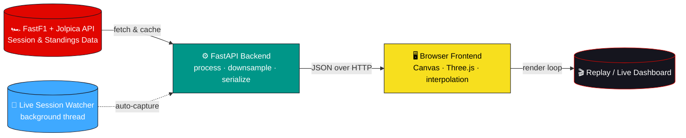

<div align="center">


<a href="https://github.com/DevGopi-16/f1-race-replay">
  
</a>

<br/>


<br/><br/>


<sub>2025 Singapore GP · Marina Bay · Lap 52/62 — full leaderboard, tyre compounds, live telemetry & DRS overlays</sub>

<br/><br/>

<a href="#-getting-started"></a>
<a href="#-features"></a>
<a href="#-architecture"></a>
<a href="#-project-structure"></a>
<a href="#-contributing"></a>

</div>

[](https://github.com/DevGopi-16)

## 💡 Why This Exists

> F1 broadcasts show you *what* is happening. FastF1 gives you the raw telemetry that explains *why*.

This project bridges the two — turning session-level timing and telemetry data into an interactive, replayable dashboard anyone can explore in a browser, with zero Python or notebooks required on the viewer's end.

It's also a real engineering exercise in its own right: large time-series datasets, client-side interpolation for smooth animation, a live-session watcher that auto-detects and captures ongoing races, a 3D WebGL track visualization, and a full rendering pipeline built from scratch on HTML5 Canvas and Three.js.

[](https://github.com/DevGopi-16)

## ✨ Features

<table>
<tr>
<td width="50%" valign="top">

### 🏁 Race Replay
- Accurate track map with animated car positions
- Sector visualization (S1 / S2 / S3) & toggleable DRS zones
- Seekable timeline with incident markers (🟡 Yellow / 🔴 Red / 🚨 SC / VSC)
- Variable playback speed (0.5x – 4x)

### 📊 Live Telemetry & Timing
- Speed, gear, throttle %, brake %, DRS status per driver
- Live timing tower — position, gaps, sector times, tyre compound & pit status
- Auto-detects and captures **live sessions** in real time (no replay lag)
- Race control feed — penalties, flags, deleted laps, investigations

</td>
<td width="50%" valign="top">

### 🧑‍✈️ Driver Panel
- Full season standings with live points/position from the Jolpica F1 API
- Rich driver profile pages — bio, points progression chart, race-by-race results
- Auto-computed "Key Strengths" badges based on real season stats
- Head-to-head teammate comparison with animated stat bars
- Minimal **3D animated track map** (Three.js) — sector-colored, glowing car trail

### 🛞 Tyre Strategy & Weather
- Current compound (Soft / Medium / Hard) & stint age per driver
- Track/air temperature, humidity, wind speed, rain status

</td>
</tr>
</table>

### 🔬 Multi-Driver Comparison
Overlaid speed / throttle / brake traces for any two drivers on a shared distance grid, with a live delta readout between them.

### 🔐 Accounts
Sign-up/login (Racer PRO) with hashed credentials, so personalized features can be added going forward.

<br/>

### 🎮 Playback Controls

<div align="center">

| Key | Action | Key | Action |
|:---:|:---|:---:|:---|
| `Space` | Play / Pause | `1`–`4` | Set speed (0.5x/1x/2x/4x) |
| `←` `→` | Rewind / Forward | `R` | Restart |
| `↑` `↓` | Speed +/− | `D` | Toggle DRS zones |
| `S` | Toggle sectors | `B` | Toggle progress bar |
| `H` | Toggle panel visibility | `Shift+Click` | Select multiple drivers |

</div>

[](https://github.com/DevGopi-16)

## �� Architecture


```mermaid
flowchart LR
    A[("🏎️ FastF1 + Jolpica API<br/>Session & Standings Data")] -->|fetch & cache| B["⚙️ FastAPI Backend<br/>process · downsample · serialize"]
    B -->|JSON over HTTP| C["🖥️ Browser Frontend<br/>Canvas · Three.js · interpolation"]
    L[("📡 Live Session Watcher<br/>background thread")] -.->|auto-capture| B
    C -->|render loop| D[("🎬 Replay / Live Dashboard")]

    style A fill:#E10600,stroke:#15151E,color:#fff
    style B fill:#009688,stroke:#15151E,color:#fff
    style C fill:#F7DF1E,stroke:#15151E,color:#000
    style D fill:#15151E,stroke:#E10600,color:#fff
    style L fill:#3fa9ff,stroke:#15151E,color:#fff
```

Telemetry is fetched once per session via FastF1 (with standings/points pulled live from the Jolpica API), cached locally, downsampled and serialized on the backend, then streamed to the browser — where it's interpolated frame-by-frame for smooth playback without shipping every raw data point over the wire. A background watcher thread auto-detects live sessions and captures them in parallel, so the same endpoints serve both historical replays and live races.

[](https://github.com/DevGopi-16)

## 🛠 Tech Stack

<div align="center">

| Layer | Technology |
|:---|:---|
| **Backend** |  Python, SQLAlchemy (auth) |
| **Data Sources** |  Jolpica F1 API (standings) |
| **Frontend** |    |
| **Rendering** | HTML5 Canvas · SVG overlays · Three.js (3D track map) |

</div>

<br/>

## 📂 Project Structure

<details>
<summary><b>Click to expand full directory tree</b></summary>

```text
F1-RACE-REPLAY-WEB/
├── assets/
│   ├── banners/
│   ├── dividers/
│   ├── file_headers/
│   ├── headers/
│   ├── icons/
│   ├── loadings/
│   ├── progress_bars/
│   └── visuals/
│
├── backend/
│   ├── .env.example
│   ├── data/
│   │   └── drivers.json
│   ├── computed_data/              # cached season stats snapshots
│   │
│   ├── src/
│   │   ├── auth/                   # signup/login (Racer PRO)
│   │   ├── lib/                    # settings, time, tyre helpers
│   │   ├── live/                   # live-session watcher + shared state
│   │   │
│   │   ├── driver_panel.py         # standings, season stats, driver profiles
│   │   ├── constructors_panel.py   # constructor standings, team stats, profiles
│   │   ├── f1_data.py              # core FastF1 replay pipeline
│   │   ├── minisectors.py
│   │   ├── next_session.py
│   │   ├── race_control.py
│   │   ├── serialize.py
│   │   ├── timing_tower.py
│   │   └── track_geometry.py
│   │
│   ├── test_telemetry_debug.py     # telemetry debugging/testing
│   ├── main.py
│   └── requirements.txt
│
├── frontend/
│   ├── index.html
│   │
│   └── static/
│       ├── images/
│       │
│       ├── app.js
│       ├── auth.css
│       ├── auth.js
│       │
│       ├── constructors-panel.css
│       ├── constructors-panel.js
│       │
│       ├── driver-panel.css
│       ├── driver-panel.js
│       │
│       ├── home-dashboard.css
│       ├── replay.css
│       │
│       ├── session-panel.css
│       ├── session-panel.js
│       │
│       ├── style.css
│       │
│       ├── timing-tower.css
│       ├── timing-tower.js
│       │
│       └── track-map.css
│       └── track-map.js             # 3D Three.js track view
│
├── README.md
└── requirements.txt
```

</details>

[](https://github.com/DevGopi-16)

## 🚀 Getting Started

### Prerequisites


### Installation & Run

```bash
git clone https://github.com/DevGopi-16/f1-race-replay.git
cd F1-RACE-REPLAY-WEB/backend

python -m venv venv
source venv/bin/activate      # Windows: venv\Scripts\activate

pip install -r requirements.txt
cp .env.example .env          # fill in any required secrets (auth, etc.)

uvicorn main:app --reload --port 8000
```

<div align="center">

**➜ Open [http://localhost:8000](http://localhost:8000)**

</div>

> ℹ️ First load per race takes longer — FastF1 downloads and caches session data locally. Live-timing and 3D track map features need an internet connection at runtime (Three.js is loaded from a CDN).

<br/>

## ⚡ Performance

Telemetry is **downsampled server-side** before transmission, then **interpolated client-side** for smooth animation — keeping payloads small without sacrificing playback quality. Driver season stats (podiums, poles, fastest laps) are cached to disk and refreshed on a rolling basis, so they don't re-trigger a full FastF1 recompute on every request.

[](https://github.com/DevGopi-16)

## 🗺 Roadmap

- [ ] Track dominance map (fastest driver per mini-sector)
- [ ] Pit stop strategy timeline
- [ ] Exportable replay clips (GIF/MP4)
- [ ] Full live session mode via WebSockets (currently polling-based)
- [ ] Historical head-to-head across multiple seasons

<br/>

## 🤝 Contributing

Contributions, ideas, and feature requests are welcome!

```bash
# 1. Fork the repository
# 2. Create a feature branch
git checkout -b feature/my-feature

# 3. Commit your changes
git commit -m "Add my feature"

# 4. Open a Pull Request
```

<br/>

## 📄 License

Released under the **MIT License** — see [LICENSE](LICENSE) for details.

<br/>

<div align="center">

## ⭐ Support

If this project is useful or interesting to you, a star on GitHub goes a long way — and feel free to connect if you're working on anything similar with FastF1 or motorsport data.


</div>
